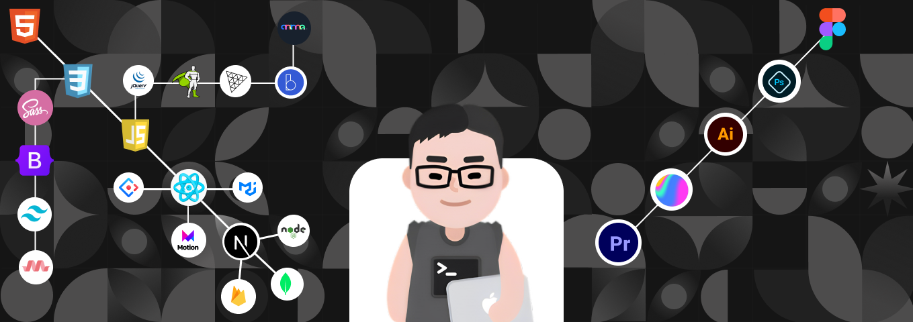
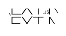

<h1 align="center">Hi 👋, I'm Naymur Rahman</h1>
<h3 align="center">A passionate frontend developer from Bangladesh, I specialize in building beautiful and functional websites and applications using technologies like HTML, CSS, JavaScript, TailwindCss, Ant Design, MUI React.js, Next.js, node.js, express.js, mongoDB. In addition to my technical skills, I am proficient in design tools like Figma and Photoshop. My GitHub profile showcases a variety of projects that demonstrate my abilities and passion for problem-solving and creating. Thank you for visiting my profile and I hope you find something that interests you!</h3>

  

  

- 🔭 I’m currently working on **Augier-art** as Freelance Front-end Developer

- 💬 Ask me about **html&css, javascript,react.js, next.js, three.js & gsap**

- 📫 How to reach me **naymur.contact@gmail.com**

- ⚡ Fun fact **I think I am funny**

<h3 align="left">Connect with me:</h3>

<h3 align="left">Languages and Tools:</h3>
 
             

<!-- 

&nbsp;
 -->

